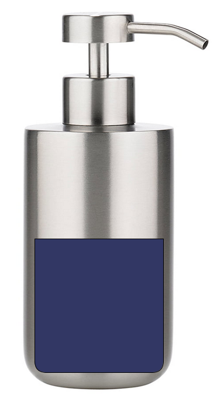

Objektorientiertes Programmieren
Processing mit Java
==

## Hinweise
- Ein Seifenspender der wieder aufgefüllt werden kann.
- Beachte Konsolenausgabe

      public class X {
            public static void main( String[] args ) {
            
            }
      }

 
